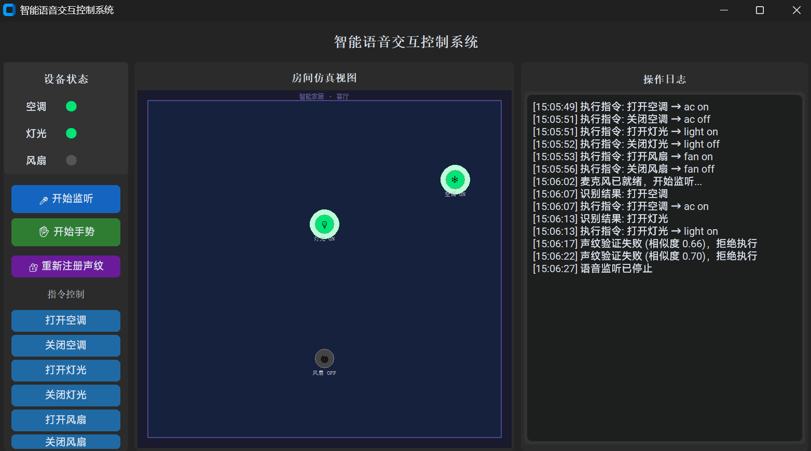

# VIVI-cs (Visualised Intelligent Voice Interaction Control System)

> 中级项目课作业 · 智能交互控制系统 Demo

特别简陋的 demo 欢迎交流

本项目是一套基于 Python 的**可视化智能语音交互控制系统**，综合运用 GUI 界面开发、仿真建模、语音识别、手势识别、声纹鉴别等技术，实现对虚拟智能家居设备（空调、灯光、风扇）的控制。

---

## 功能特性

- **语音控制**：接入 Google STT 实现中文指令识别，支持环境降噪，多线程后台监听不卡界面
- **手势控制**：基于 MediaPipe 手部关键点检测，支持左右手，OpenCV 窗口实时可视化
- **声纹鉴别**：基于 resemblyzer 提取说话人嵌入向量，余弦相似度校验，非授权用户拒绝执行
- **仿真建模**：CustomTkinter + Canvas 绘制房间俯视图，设备 ON/OFF 状态实时发光效果
- **操作日志**：所有指令、识别结果、异常信息实时输出到界面日志面板

---

## 系统截图



---

## 快速开始

### 环境要求

- Python 3.11+
- [uv](https://github.com/astral-sh/uv) 包管理器（推荐）

### 安装

```bash
# 克隆仓库
git clone https://github.com/alglb123/VIVIcs.git
cd VIVIcs

# 安装依赖
uv sync
```

### 运行

```bash
uv run python main.py
```

---

## 使用说明

### 语音控制

1. 点击 **🎤 开始监听**（按钮变红表示监听中）
2. 对麦克风说出指令
3. 识别结果自动执行，Canvas 实时刷新
4. 点击 **⏹ 停止监听** 结束

**支持指令：**

| 指令 | 效果 |
|------|------|
| 打开空调 / 关闭空调 | 控制空调开关 |
| 打开灯光 / 关闭灯光 | 控制灯光开关 |
| 打开风扇 / 关闭风扇 | 控制风扇开关 |

### 手势控制

1. 点击 **✋ 开始手势**，弹出摄像头窗口
2. 对摄像头做出手势

| 手势 | 指令 |
|------|------|
| 手掌张开（四指伸直） | 打开灯光 |
| 握拳（四指弯曲） | 关闭灯光 |
| 比耶 ✌ | 打开空调 |
| 举手 ☝ | 关闭空调 |

3. 按 `q` 或关闭窗口停止

### 声纹注册

1. 点击 **🔐 注册声纹**
2. 按日志提示录制 3 段语音（各 5 秒）
3. 注册完成后每次语音指令前自动校验身份
4. 相似度低于阈值时拒绝执行并记录日志

> 可在 `config.py` 中调整 `VOICEPRINT_THRESHOLD`（默认 0.75）

---

## 项目结构

```
├── main.py                      # 程序入口
├── config.py                    # 全局配置（阈值、设备列表等）
├── hand_landmarker.task         # MediaPipe 手部关键点模型
├── modules/
│   ├── event_bus.py             # 事件总线（Queue，线程安全）
│   ├── control/
│   │   ├── command_dict.py      # 语音/手势指令字典
│   │   ├── device_state.py      # 设备状态全局管理
│   │   └── executor.py          # 指令执行器
│   ├── gui/
│   │   ├── main_window.py       # 主窗口（三栏布局）
│   │   ├── device_panel.py      # 设备指示灯面板
│   │   ├── log_panel.py         # 日志输出面板
│   │   └── room_canvas.py       # Canvas 仿真建模
│   ├── voice/
│   │   └── listener.py          # 麦克风采集 + 降噪 + ASR
│   ├── gesture/
│   │   └── detector.py          # 手势检测 + OpenCV 可视化
│   └── voiceprint/
│       ├── enroll.py            # 声纹注册
│       └── verifier.py          # 声纹校验
```

---

## 技术栈

| 库 | 版本 | 用途 |
|----|------|------|
| [customtkinter](https://github.com/TomSchimansky/CustomTkinter) | ≥5.2 | 现代化 GUI 框架 |
| [SpeechRecognition](https://github.com/Uberi/speech_recognition) | ≥3.16 | Google STT 中文识别 |
| [noisereduce](https://github.com/timsainburg/noisereduce) | ≥3.0 | 环境降噪 |
| [mediapipe](https://github.com/google-ai-edge/mediapipe) | ≥0.10 | 手部关键点检测 |
| [resemblyzer](https://github.com/resemble-ai/Resemblyzer) | ≥0.1 | 声纹嵌入向量提取 |
| [opencv-python](https://github.com/opencv/opencv-python) | ≥4.8 | 摄像头采集与可视化 |
| [pyaudio](https://github.com/jleb/pyaudio) | ≥0.2 | 麦克风音频采集 |
